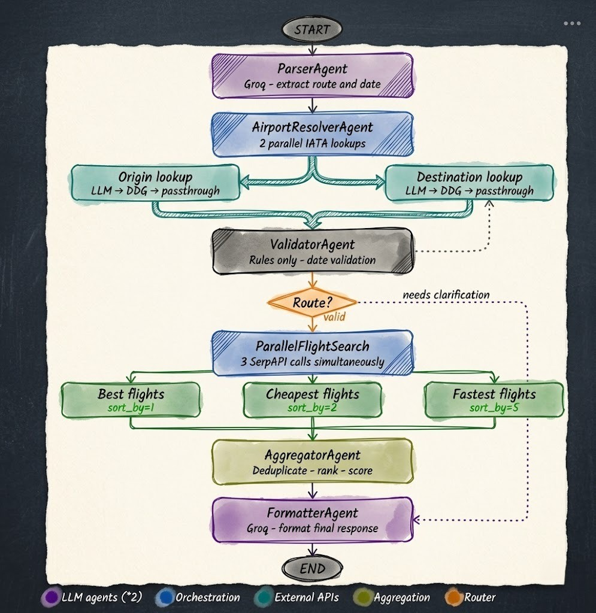
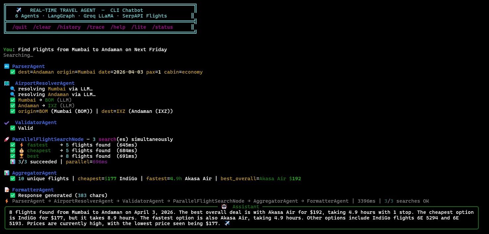
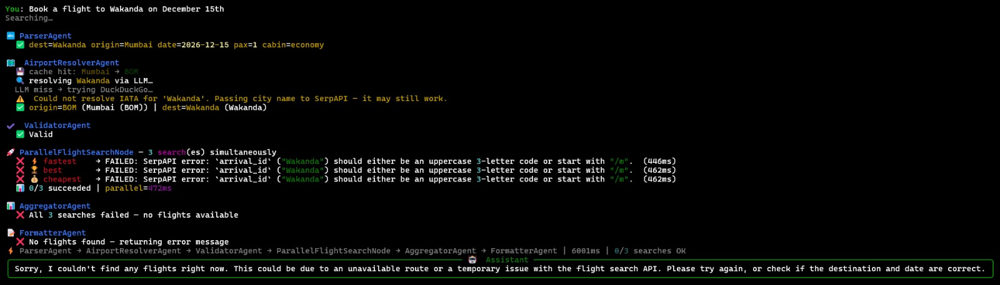
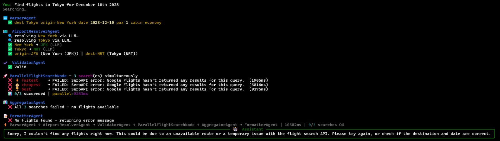
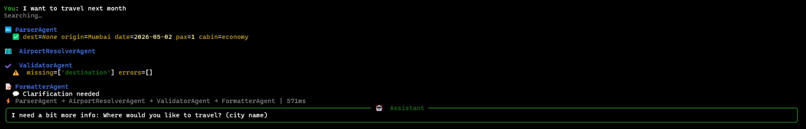

# Flight-Agent

A real-time travel planning system built with **6 specialized AI agents** orchestrated via **LangGraph**, powered by **Groq LLaMA 3.3 70B** and **SerpAPI Google Flights**. The system uses parallel execution to query multiple flight search perspectives simultaneously, aggregates and ranks results, and returns a natural-language response to the user.

**Repository**: [https://github.com/suvraadeep/Flight-Agent.git](https://github.com/suvraadeep/Flight-Agent.git)

---

## Architecture Overview

<p align="center">
  
</p>

The pipeline is a **directed acyclic graph (DAG)** compiled by LangGraph's `StateGraph`. Each node in the graph is a single-responsibility agent that reads from and writes to a shared, immutable-by-convention `TravelState` context. The graph has two execution phases:

1. **Sequential phase**: `ParserAgent` > `AirportResolverAgent` > `ValidatorAgent` (each depends on the previous output)
2. **Parallel phase**: `ParallelFlightSearchNode` launches 3 concurrent SerpAPI calls, followed by `AggregatorAgent` > `FormatterAgent`

A conditional edge after `ValidatorAgent` short-circuits directly to `FormatterAgent` when clarification is needed, skipping the expensive flight search entirely.

```
START
  |
  v
ParserAgent  (LLM: extract destination, dates, cabin, passengers)
  |
  v
AirportResolverAgent  (2 parallel IATA lookups: origin + destination)
  |
  v
ValidatorAgent  (rules-based: checks required fields, date validity)
  |
  +--[needs clarification]--> FormatterAgent --> END
  |
  +--[valid]
  |
  v
ParallelFlightSearchNode  (3 SerpAPI calls in parallel: best, cheapest, fastest)
  |
  v
AggregatorAgent  (deduplicate, score, rank)
  |
  v
FormatterAgent  (LLM: natural-language summary)
  |
  v
END
```

---

---

## Project Structure

```
Flight-Agent/
|-- .env.example          # Environment variable template
|-- config.py             # Configuration (API keys, model, timeouts)
|-- state.py              # TravelState TypedDict definition
|-- utils/
|   |-- __init__.py
|   |-- logger.py         # Execution trace entry builder
|   |-- iata.py           # LLM-first IATA resolution with DDG fallback
|-- agents/
|   |-- __init__.py
|   |-- parser_agent.py   # LLM: free-text to structured JSON
|   |-- airport_agent.py  # Parallel IATA code resolution
|   |-- validator_agent.py# Rules-based field and date validation
|   |-- flight_search_agent.py  # 3 parallel SerpAPI searches
|   |-- aggregator_agent.py     # Dedup, score, rank
|   |-- formatter_agent.py      # LLM: data to natural-language response
|-- graph/
|   |-- __init__.py
|   |-- orchestrator.py   # LangGraph DAG: wiring agents + conditional edges
|-- main.py               # CLI chatbot with Rich UI
|-- requirements.txt
```

---

## Why 6 Agents?

The system uses exactly **6 agents**, each with a clear single responsibility. This number is deliberate: not 5; not 7.

| # | Agent | Type | Responsibility |
|---|-------|------|----------------|
| 1 | **ParserAgent** | LLM | Extract structured travel data (destination, origin, date, passengers, cabin class) from free-text user input |
| 2 | **AirportResolverAgent** | LLM + Web | Convert city names to IATA airport codes via LLM lookup with DuckDuckGo fallback |
| 3 | **ValidatorAgent** | Rules-based | Validate required fields exist, check date is not in the past, determine if clarification is needed |
| 4 | **ParallelFlightSearchNode** | External API | Launch 3 concurrent SerpAPI Google Flights searches (sorted by best, cheapest, fastest) |
| 5 | **AggregatorAgent** | Deterministic | Deduplicate flights across search perspectives, compute composite scores (60% price + 40% duration), rank results |
| 6 | **FormatterAgent** | LLM | Generate a concise, user-friendly natural-language response from the ranked flight data |

### Why not fewer agents?

**Parsing and validation are deliberately separate.** The ParserAgent uses an LLM to extract structured data from natural language, which is a fundamentally different operation from the ValidatorAgent's deterministic rules (checking for missing fields, validating dates). Combining them would mix probabilistic LLM behavior with strict business logic, making the system harder to debug and test. When the parser returns garbage JSON, the validator catches it cleanly and routes to clarification without wasting API calls on flight searches.

**The AggregatorAgent exists because parallel search results need non-trivial merging.** Three independent searches return overlapping flights from different sort perspectives. Without deduplication and composite scoring, the user would see duplicate entries or miss the actual best deal. The aggregator normalizes prices and durations across all results and applies a weighted scoring formula. Embedding this logic in the search node or formatter would violate single responsibility and make the pipeline harder to extend.

### Why not more agents?

The AirportResolverAgent could theoretically be split into two (one per city), but they share the same resolution logic and cache. Running them as two `ThreadPoolExecutor` workers inside one agent gives us parallelism without the overhead of two separate graph nodes. Similarly, the 3 flight searches are logically one "search node" that internally parallelizes since they share identical input parameters and differ only in sort order.

---

## Parallel Execution Design

### Which agents run in parallel and why?

Two stages of the pipeline use concurrent execution:

**Stage 1: IATA Resolution (2 parallel workers)**

The `AirportResolverAgent` resolves origin and destination city names to IATA codes simultaneously using a `ThreadPoolExecutor` with 2 workers. These lookups are completely independent since neither city needs the other's IATA code to resolve.

**Stage 2: Flight Search (3 parallel workers)**

The `ParallelFlightSearchNode` launches 3 SerpAPI calls concurrently, each with a different `sort_by` parameter:
- `sort_by=1` for best overall flights
- `sort_by=2` for cheapest flights
- `sort_by=5` for fastest flights

These are independent and share no state. Running them in parallel reduces total search time from ~15s (sequential) to ~5s (parallel), a 3x speedup.

### Which agents must run sequentially and why?

The sequential chain `Parser > AirportResolver > Validator` is strictly ordered because each agent depends on the previous:
- The `AirportResolverAgent` needs parsed city names from the `ParserAgent`
- The `ValidatorAgent` needs IATA codes and parsed dates to validate the request
- The `ParallelFlightSearchNode` needs validated IATA codes and dates to query SerpAPI

### Technology choice: ThreadPoolExecutor over asyncio

The system uses Python's `concurrent.futures.ThreadPoolExecutor` for parallel execution instead of `asyncio`. This choice was made because:
1. SerpAPI's Python client (`google-search-results`) is synchronous and blocking, making it incompatible with `asyncio` without wrapping
2. Thread pools are simpler to reason about for I/O-bound tasks like API calls
3. `as_completed()` provides natural result aggregation as threads finish
4. Per-thread timeout support via `fut.result(timeout=N)` prevents hanging

---

## Context Management: The TravelState

All agents communicate through a single **typed dictionary** called `TravelState`, defined using Python's `TypedDict`:

```python
class TravelState(TypedDict):
    user_input:            str
    conversation_history:  List[Dict[str, str]]
    parsed_data:           Optional[Dict[str, Any]]
    origin_iata:           Optional[str]
    destination_iata:      Optional[str]
    needs_clarification:   bool
    flight_results:        Annotated[List[Dict], operator.add]  # append-only
    execution_trace:       Annotated[List[Dict], operator.add]  # append-only
    best_flight:           Optional[Dict]
    final_response:        Optional[str]
    # ... additional fields
```

Key design decisions:

- **Immutable by convention**: Each agent receives the full state and returns only its updates. LangGraph merges the updates into the state. Agents never mutate the input state directly, which prevents race conditions when parallel agents write results.
- **Append-only lists for parallel results**: `flight_results` and `execution_trace` use `Annotated[List, operator.add]` so that parallel agents' return values are concatenated rather than overwritten. This is critical for the 3 parallel search threads to safely deposit results without locks or coordination.
- **Error signaling via state fields**: Agents signal errors through `parse_error`, `needs_clarification`, and `clarification_message` fields. The orchestrator checks `needs_clarification` at the conditional edge to decide whether to proceed to search or short-circuit to the formatter.

---

## Failure Handling Strategy

The system uses a **best-effort** strategy for parallel execution, not fail-fast.

### Partial failure (some searches fail)

If 1 or 2 of the 3 parallel searches fail (due to timeouts, API errors, rate limits), the system continues with whatever results are available. The aggregator logs the failures and works with the successful results. The formatter notes any unavailable search perspectives in the final response.

This is the right trade-off: showing results from 2 out of 3 sort perspectives is far more useful than returning nothing. Users would rather see partial results than an error message.

### Total failure (all searches fail)

If all 3 searches fail, the aggregator returns `None` for all flight fields. The formatter detects this and returns a meaningful error message suggesting the user check the destination and date. The system never hangs since every thread has a configurable timeout (`PROVIDER_TIMEOUT`, default 20s).

### Timeout handling

Each parallel thread has a per-task timeout via `fut.result(timeout=PROVIDER_TIMEOUT)`. The outer `as_completed()` call also has a ceiling timeout of `PROVIDER_TIMEOUT + 5` seconds. If a thread exceeds the timeout, it is marked as failed and the system continues with the remaining results.

### Retry logic

The IATA resolution subsystem (`utils/iata.py`) has built-in retry logic for DuckDuckGo searches (3 attempts with exponential backoff). SerpAPI calls do not retry since they are metered and a retry on a fundamentally broken query (invalid IATA code) would waste API quota without helping.

---

## Observability and Debugging

Every agent writes to the `execution_trace` list (append-only via `operator.add`), capturing:

```python
{
    "agent":          "ParallelFlightSearchNode",
    "status":         "success",          # success | error | fallback | clarification_needed
    "duration_ms":    5540.1,
    "input_summary":  "3 searches launched simultaneously",
    "output_summary": "3/3 succeeded in 5540ms",
    "timestamp":      "2026-04-02T17:30:00"
}
```

The CLI displays two levels of detail:
- **Default mode**: Single-line summary showing the agent chain, total time, and search success rate
- **Verbose mode (`-v`)**: Full execution trace table with per-agent timing, status, and output

Rich console output during execution shows real-time progress through each agent, making it straightforward to see which agents ran in parallel and where failures occurred.

---

## Demo

### Test Case 1: Happy Path (All 3 Parallel Searches Succeed)

```
Prompt: "Find Flights from Mumbai to Andaman on Next Friday"
```

All 6 agents execute successfully. The 3 parallel searches (best, cheapest, fastest) all return results. The aggregator deduplicates 18 raw results into 10 unique flights, ranks them by composite score, and the formatter produces a natural-language summary.

<p align="center">
  
</p>

Notice how all 3 searches complete in ~696ms total (parallel), compared to the ~2000ms it would take sequentially. The execution trace at the bottom shows the full agent chain with 3/3 searches OK.

---

### Test Case 2: All Parallel Agents Fail (Invalid Destination)

```
Prompt: "Book a flight to Wakanda on December 15th"
```

The ParserAgent correctly extracts "Wakanda" as the destination. The AirportResolverAgent tries LLM lookup, falls back to DuckDuckGo, and ultimately passes "Wakanda" through as-is (graceful degradation). SerpAPI rejects the invalid arrival_id for all 3 searches. The aggregator detects 0/3 success and the formatter returns a helpful error message.

<p align="center">
  
</p>

---

### Test Case 3: All Parallel Agents Fail (No Results Available)

```
Prompt: "Find flights to Tokyo for December 10th 2028"
```

All fields are valid (Tokyo resolves to NRT, date is in the future), but SerpAPI's Google Flights has no data for dates that far out. All 3 searches return "no results for this query." The system handles this gracefully and suggests checking the destination and date.

<p align="center">
  
</p>

---

### Test Case 4: Missing Information (Clarification Needed)

```
Prompt: "I want to travel next month"
```

The ParserAgent extracts `destination=None` and `date=2026-05-02` (relative date resolution). The ValidatorAgent identifies the missing destination and flags `needs_clarification=True`. The conditional edge in the orchestrator skips the flight search entirely and routes directly to the FormatterAgent, which returns a clarification request. No API calls are wasted.

<p align="center">
  
</p>


## Setup and Installation

### Prerequisites

- Python 3.10+
- A [Groq API key](https://console.groq.com/keys) (free tier available)
- A [SerpAPI key](https://serpapi.com/) (for Google Flights search)

### Steps

1. **Clone the repository**:
```bash
git clone https://github.com/suvraadeep/Flight-Agent.git
cd Flight-Agent
```

2. **Create a virtual environment** (recommended):
```bash
python -m venv flight-agent
# On Windows:
flight-agent\Scripts\activate
# On macOS/Linux:
source flight-agent/bin/activate
```

3. **Install dependencies**:
```bash
pip install -r requirements.txt
```

4. **Configure environment variables**:
```bash
cp .env.example .env
```
Edit `.env` and add your API keys:
```
GROQ_API_KEY=gsk_your_groq_key_here
SERPAPI_KEY=your_serpapi_key_here
```

5. **Run the chatbot**:
```bash
python main.py
```

---

## Usage

### Interactive Mode
```bash
python main.py          # Standard mode
python main.py -v       # Verbose mode (shows execution trace table)
```

### Single Query Mode
```bash
python main.py -q "Book a flight to Tokyo for December 1st"
python main.py -v -q "Find flights from Mumbai to Delhi next Friday"
```

### CLI Commands (during interactive mode)
| Command | Description |
|---------|-------------|
| `/quit` | Exit the chatbot |
| `/clear` | Clear conversation history |
| `/history` | Show conversation history |
| `/trace` | Show last execution trace |
| `/lite` | Toggle LITE_MODE (1 SerpAPI call instead of 3) |
| `/status` | Show current configuration |
| `/help` | Show help |

### Testing Fault Tolerance
```bash
python main.py --fail cheapest -v -q "Flights to Paris Dec 15"     # 1 search fails
python main.py --fail best --fail cheapest --fail fastest -v -q "Flights to Paris Dec 15"  # All fail
```

---

## Environment Variables

| Variable | Required | Default | Description |
|----------|----------|---------|-------------|
| `GROQ_API_KEY` | Yes | - | Groq API key for LLaMA access |
| `SERPAPI_KEY` | Yes | - | SerpAPI key for Google Flights |
| `GROQ_MODEL` | No | `llama-3.3-70b-versatile` | Groq model name |
| `TRAVEL_CURRENCY` | No | `USD` | Currency for flight prices |
| `TRAVEL_LANG` | No | `en` | Language for search results |
| `SEARCH_TIMEOUT` | No | `20` | Per-search timeout in seconds |
| `MAX_HISTORY` | No | `10` | Max conversation turns to retain |
| `LITE_MODE` | No | `false` | If true, runs 1 search instead of 3 |

---

## Design Trade-offs and Assumptions

1. **Best-effort over fail-fast**: Partial results are more valuable than no results. If 2/3 searches succeed, the user still gets a useful response.

2. **LLM for parsing, rules for validation**: The ParserAgent handles the ambiguity of natural language ("next Friday", "business class to Tokyo"). The ValidatorAgent applies deterministic checks (is the date in the past? is the destination missing?). This separation makes failures easy to diagnose since you can see exactly whether the LLM misunderstood the input or the extracted data failed validation.

3. **LLM-first IATA resolution**: Instead of maintaining a static dictionary of city-to-IATA mappings (which would be incomplete), the system asks the LLM first (which knows virtually every airport from its training data) and falls back to DuckDuckGo search. This handles obscure airports like Dibrugarh (DIB) or Andaman (IXZ) without any hardcoded data.

4. **Immutable state with append-only lists**: The `TravelState` uses `Annotated[List, operator.add]` for `flight_results` and `execution_trace`. This means parallel threads can safely return lists that get concatenated by LangGraph's state merger, eliminating the need for locks or synchronization primitives.

5. **Thread pools over asyncio**: SerpAPI's client is synchronous. Wrapping it in `asyncio.to_thread()` adds complexity without benefit for 3 concurrent I/O tasks. `ThreadPoolExecutor` with `as_completed()` is simpler, more readable, and provides natural timeout support.

6. **Conditional routing for efficiency**: When the validator detects missing fields, the orchestrator routes directly to the formatter (skipping the 3 parallel searches). This avoids wasting SerpAPI quota on queries that would fail anyway.

---

## Extensibility

Adding a new search provider (e.g., Amadeus, Skyscanner) requires:
1. Add a new entry to `SEARCH_CONFIGS` in `config.py`
2. The `ParallelFlightSearchNode` automatically picks it up and runs it concurrently
3. The `AggregatorAgent` already handles N results generically through deduplication and scoring

Adding a new agent (e.g., a pricing prediction agent) requires:
1. Create a new function that takes `TravelState` and returns a dict of state updates
2. Add the node to the graph in `orchestrator.py`
3. Wire it with `add_edge()` or `add_conditional_edges()`

The architecture is deliberately modular: every agent is a pure function `TravelState -> Dict` with no hidden dependencies or global state mutations.

---

## License

This project is licensed under the MIT License. See the [LICENSE](LICENSE) file for details.